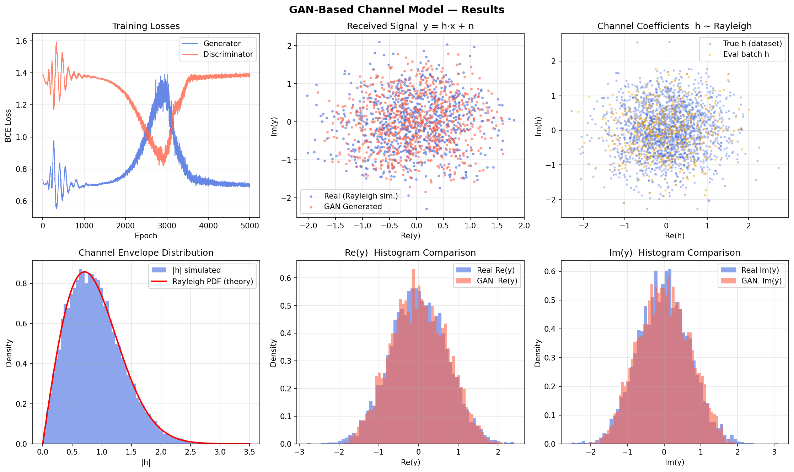

# GAN-Based Wireless Channel Model

A self-contained example that trains a **Conditional GAN (CGAN)** to learn the statistical behaviour of a Rayleigh fading wireless channel, replacing expensive ray-tracing simulators (e.g. QuaDRiGa) with a fast learned model.

---

## Overview

| Stage | Description |
|---|---|
| 1. Dataset | Simulate a Rayleigh fading channel (`h ~ CN(0,1)`) |
| 2. Symbols | QPSK constellation — 4 complex symbols |
| 3. Received signal | `y = h · x + n`, AWGN noise (σ² = 0.01) |
| 4. CGAN | Generator learns `p(y | x, h)`; Discriminator learns to distinguish real from fake |
| 5. Evaluation | Compare real vs. GAN-generated scatter plots and histograms |

---

## Repository Structure

```
channel-gan-example/
├── gan-channel/
│   ├── gan_channel_example.py   # Main training + evaluation script
│   ├── gan_channel_results.png  # Example output plot
│   └── gan_channel_results_1.png
├── requirements.txt
└── README.md
```

---

## Requirements

- Python 3.9+
- pip packages listed in `requirements.txt`

```
numpy>=1.24
torch>=2.0
matplotlib>=3.7
```

---

## Installation

```bash
# 1. Clone the repository
git clone https://github.com/tvy14/channel-gan-example.git
cd channel-gan-example

# 2. (Optional) Create and activate a virtual environment
python -m venv venv
source venv/bin/activate        # Linux / macOS
# venv\Scripts\activate         # Windows

# 3. Install dependencies
pip install -r requirements.txt
```

---

## Running the Example

```bash
python gan-channel/gan_channel_example.py
```

Expected console output:

```
Using device: cpu          # or 'cuda' if a GPU is available
  Epoch  600/3000 | D_loss=1.3612  G_loss=0.6881
  Epoch 1200/3000 | D_loss=1.3524  G_loss=0.6917
  Epoch 1800/3000 | D_loss=1.3501  G_loss=0.6943
  Epoch 2400/3000 | D_loss=1.3489  G_loss=0.6931
  Epoch 3000/3000 | D_loss=1.3478  G_loss=0.6924
Training complete.
Plot saved → .../gan_channel_results_1.png
```

Training runs for **3 000 epochs** (batch size 256) and takes roughly:
- ~2 min on a modern CPU
- ~20 sec on a CUDA GPU

---

## How It Works

### 1. Channel Dataset
A Rayleigh fading channel coefficient is sampled as:

```
h = h_r + j·h_i,   h_r, h_i ~ N(0, 0.5)
```

This produces `|h|` that follows a Rayleigh distribution, matching real-world multipath fading.

### 2. Received Signal Generation
For each training batch, `generate_real_samples()`:
1. Draws random channel realisations `h` from the dataset.
2. Picks random QPSK symbols `x` from `{±1±j} / √2`.
3. Computes the received signal `y = h·x + n` where `n ~ N(0, 0.01·I)`.
4. Returns `(y, conditioning)` where `conditioning = [Re(x), Im(x), Re(h), Im(h)] / 3`.

### 3. Conditional GAN Architecture

**Generator** — takes noise `z` (dim 8) and conditioning `c` (dim 4), outputs fake `ŷ` (dim 2):

```
[z ∥ c] → Linear(12→64) → LeakyReLU → Linear(64→64) → LeakyReLU → Linear(64→2)
```

**Discriminator** — takes a signal `y` (dim 2) and conditioning `c` (dim 4), outputs real/fake probability:

```
[y ∥ c] → Linear(6→64) → LeakyReLU → Linear(64→64) → LeakyReLU → Linear(64→1) → Sigmoid
```

### 4. Training Loop
Both networks are trained with **Binary Cross-Entropy** loss and **Adam** optimiser (`lr=2e-4`, `β=(0.5, 0.999)`):

```
D_loss = BCE(D(real_y, c), 1) + BCE(D(G(z, c), c), 0)
G_loss = BCE(D(G(z, c), c), 1)
```

---

## Output Plots

The script saves a 2×3 figure with:

| Plot | Description |
|---|---|
| Training Losses | Generator and Discriminator BCE loss curves |
| Received Signal Scatter | Real vs. GAN-generated `y` in the complex plane |
| Channel Coefficients | True Rayleigh `h` samples scatter |
| Channel Envelope | `|h|` histogram vs. theoretical Rayleigh PDF |
| Re(y) Histogram | Real vs. GAN marginal distribution comparison |
| Im(y) Histogram | Real vs. GAN marginal distribution comparison |

Example output:



---

## GPU Support

The script automatically uses CUDA if available:

```python
device = torch.device('cuda' if torch.cuda.is_available() else 'cpu')
```

No code changes needed — just run on a machine with a CUDA-capable GPU.

---

## References

- Goodfellow et al., *Generative Adversarial Networks*, NeurIPS 2014
- Mirza & Osindero, *Conditional Generative Adversarial Nets*, arXiv 2014
- O'Shea & Hoydis, *An Introduction to Deep Learning for the Physical Layer*, IEEE TCCN 2017
